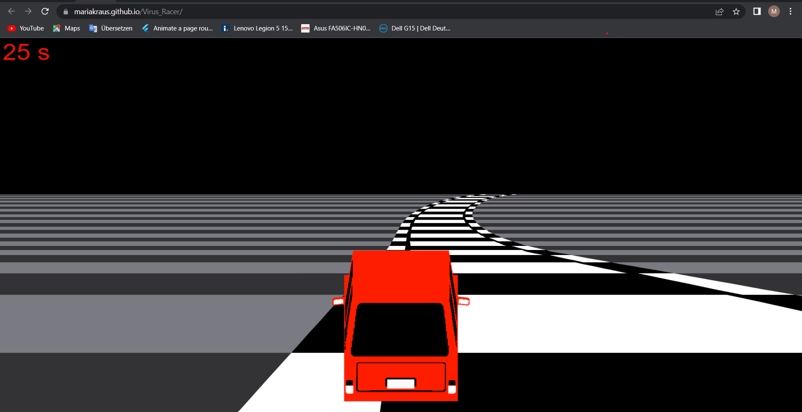
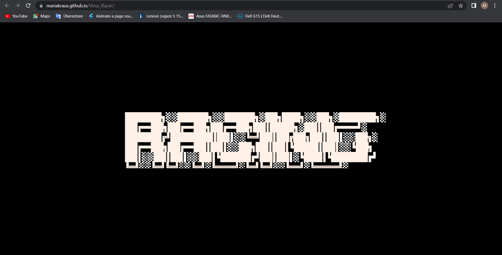

# Racing
The goal of this project was to create an interactive HTML5 Webapplication, that uses different mobile sensors. 
Sensors used are touch, screen orientation and gyro sensors for steering.
The Webapp adapts to different screen sizes. The steering is adapted according to the device type.

It is a pseudo3D racing game. It uses projection and html canvas to create the illusion of a moving road.

The project uses the libraries:
- phaser3
- gyro

## Functionality
- For steering on mobile devices: use gyro sensors of mobile, touch for start
- For steering on desktop devices: use left/right arrow keys for steering, click for start

Game:

Pause scene:

